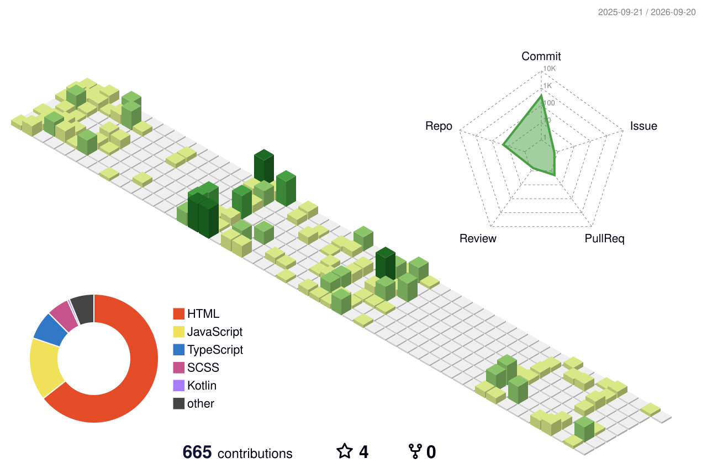

<br/>

I’m **Farhad Sultanov**, a frontend developer from **Baku, Azerbaijan**.  
I like building interfaces that are clear, responsive and satisfying to use — from web products to React Native experiences and open-source developer tools.

[](https://github.com/ferhadsultan98)
[](https://www.linkedin.com/in/farhadsultan98)
[](https://www.instagram.com/ferhad.sultann)

---

## Selected work

### [moticon](https://github.com/ferhadsultan98/moticon)
Animated icon tooling built around motion, interaction and reusable UI behavior.

`TypeScript` `React` `Animation` `Open Source`

### [react-native-liquid-glass-kit](https://github.com/ferhadsultan98/react-native-liquid-glass-kit)
React Native UI experimentation focused on modern native-feeling visual effects.

`React Native` `Kotlin` `Mobile UI`

### [sultan-ai-skills](https://github.com/ferhadsultan98/sultan-ai-skills)
Developer tooling and reusable skill experiments.

`JavaScript` `Developer Tools`

### [instagramverify](https://github.com/ferhadsultan98/instagramverify)
A web project exploring interface implementation and frontend interaction.

`HTML` `Frontend`

→ **[Browse all repositories](https://github.com/ferhadsultan98?tab=repositories)**

---

## Toolbox

**Frontend**


**Mobile & runtime**


**Workflow & design**


---

## What I care about

```text
01  CLARITY       interfaces should explain themselves
02  MOTION        animation should guide, not distract
03  SYSTEMS       reusable components beat one-off solutions
04  PERFORMANCE   polish means nothing if the product feels slow
05  SHIPPING      ideas matter when real people can use them
```

---

## Contribution landscape

This section is generated automatically from my real GitHub contribution history.

<picture>
  <source media="(prefers-color-scheme: dark)" srcset="./profile-3d-contrib/profile-night-view.svg">
  <source media="(prefers-color-scheme: light)" srcset="./profile-3d-contrib/profile-green-animate.svg">
  
</picture>

<details>
<summary><b>Arcade mode</b> — contribution graph, but make it move</summary>

<br/>

<picture>
  <source media="(prefers-color-scheme: dark)" srcset="https://raw.githubusercontent.com/ferhadsultan98/ferhadsultan98/output/github-contribution-grid-snake-dark.svg">
  <source media="(prefers-color-scheme: light)" srcset="https://raw.githubusercontent.com/ferhadsultan98/ferhadsultan98/output/github-contribution-grid-snake.svg">
  
</picture>

</details>

---

## Current mode

```yaml
role: frontend-developer
location: Baku, Azerbaijan
focus:
  - React
  - React Native
  - TypeScript
  - UI engineering
  - open source

status: building
```

---

## Contact

I’m always interested in thoughtful frontend work, UI engineering and open-source collaboration.

**LinkedIn:** [linkedin.com/in/farhadsultan98](https://www.linkedin.com/in/farhadsultan98)  
**Instagram:** [@ferhad.sultann](https://www.instagram.com/ferhad.sultann)  
**GitHub:** [@ferhadsultan98](https://github.com/ferhadsultan98)

<sub>Designed as a profile, not a dashboard.</sub>
